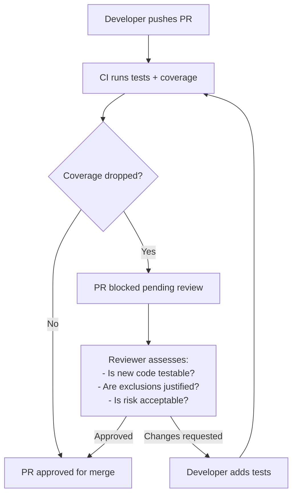
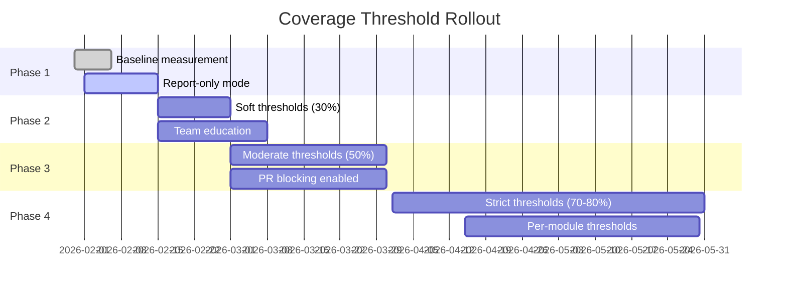

# Comprehensive Analysis: Jest + Istanbul/nyc Integration for Node.js/TypeScript/Prisma/SQLite Project

## Executive Summary

Based on my analysis of your codebase, **Jest is already integrated and operational** in your project. The question is not whether to adopt Jest, but whether to enhance it with **code coverage reporting (Istanbul/nyc)** and **CI/CD integration**. Given your project's mature testing infrastructure, established DI patterns, and recent Prisma schema modernization (removing deprecated `url` property), I recommend **adopting coverage reporting now with a phased threshold enforcement strategy**.

---

## Current State Assessment

### Existing Testing Infrastructure

Your project already has a solid testing foundation:

| Component | Status | Location |
|-----------|--------|----------|
| **Jest** | ✅ Installed & Configured | [`backend/jest.config.js`](backend/jest.config.js:1) |
| **ts-jest** | ✅ Installed | [`backend/package.json`](backend/package.json:66) |
| **Test Scripts** | ✅ Defined | [`backend/package.json`](backend/package.json:10) |
| **Unit Tests** | ✅ 20+ test files | [`backend/src/tests/unit/*.test.ts`](backend/src/tests/unit/product.service.test.ts:1) |
| **Integration Tests** | ✅ Prisma service tests | [`backend/src/tests/integration/prisma-services.test.ts`](backend/src/tests/integration/prisma-services.test.ts:1) |
| **Mock Infrastructure** | ✅ Database mocks | [`backend/src/__mocks__/database.ts`](backend/src/__mocks__/database.ts:1) |

### Key Architectural Strengths

1. **Dependency Injection Pattern**: Services like [`ProductService`](backend/src/services/product.service.ts:209) accept optional `PrismaClient` injection, enabling testability:
   ```typescript
   constructor(prismaClient?: PrismaClient) {
     this.prisma = prismaClient ?? getDefaultDatabaseClient();
   }
   ```

2. **Database Factory Abstraction**: [`database-factory.ts`](backend/src/database/database-factory.ts:83) provides environment-aware client creation with test database support.

3. **Prisma Schema Modernization**: Your schema at [`backend/prisma/schema.prisma`](backend/prisma/schema.prisma:14-16) uses the modern datasource configuration without the deprecated `url` property, indicating active maintenance.

---

## Detailed Analysis by Category

### 1. Implementation Complexity & Initial Setup Time

#### Current State: LOW Complexity ✅

Since Jest is already configured, adding coverage is straightforward:

```javascript
// jest.config.js additions (estimated 5-10 minutes)
module.exports = {
  // ... existing config
  collectCoverageFrom: [
    'src/**/*.ts',
    '!src/**/*.d.ts',
    '!src/tests/**',
    '!src/__mocks__/**',
    '!src/migrations/**',
  ],
  coverageReporters: ['text', 'text-summary', 'lcov', 'html'],
  coverageDirectory: 'coverage',
};
```

**Setup Tasks:**
| Task | Effort | Notes |
|------|--------|-------|
| Update jest.config.js | 5 min | Add coverage configuration |
| Add coverage script to package.json | 2 min | `"test:coverage": "jest --coverage"` |
| Add .gitignore entries | 2 min | `/coverage` directory |
| Verify TypeScript source maps | 5 min | Ensure accurate coverage mapping |
| **Total** | **~15 minutes** | Minimal disruption |

#### Prisma-Specific Considerations

Your project uses a hybrid approach (better-sqlite3 for legacy, Prisma for new code). Coverage configuration should exclude:
- Generated Prisma client code
- Migration files
- Legacy database adapter code (if not tested)

```javascript
// Recommended coverage exclusions
collectCoverageFrom: [
  'src/**/*.ts',
  '!src/**/*.d.ts',
  '!src/tests/**',
  '!src/__mocks__/**',
  '!src/migrations/**',
  '!src/database/database-factory.ts', // If integration-tested only
],
```

---

### 2. CI/CD Integration Requirements

#### GitHub Actions Integration

```yaml
# .github/workflows/test.yml
name: Test & Coverage

on:
  pull_request:
    branches: [main, develop]

jobs:
  test:
    runs-on: ubuntu-latest
    steps:
      - uses: actions/checkout@v4
      
      - name: Setup Node.js
        uses: actions/setup-node@v4
        with:
          node-version: '20'
          cache: 'npm'
      
      - name: Install dependencies
        run: cd backend && npm ci
      
      - name: Run tests with coverage
        run: cd backend && npm run test:coverage
      
      - name: Upload coverage to Codecov
        uses: codecov/codecov-action@v3
        with:
          files: ./backend/coverage/lcov.info
          fail_ci_if_error: false
      
      - name: Comment coverage on PR
        uses: romeovs/lcov-reporter-action@v0.3.1
        with:
          lcov-file: ./backend/coverage/lcov.info
          github-token: ${{ secrets.GITHUB_TOKEN }}
```

**CI/CD Complexity Assessment:**
| Aspect | Complexity | Notes |
|--------|------------|-------|
| GitHub Actions setup | Low | Standard Node.js workflow |
| Coverage artifact upload | Low | Built-in actions available |
| PR comment integration | Low | Third-party actions exist |
| SQLite test database | Medium | Requires file-based test DB setup |
| **Overall** | **Low-Medium** | ~2-3 hours initial setup |

#### SQLite-Specific CI Considerations

Your tests use file-based SQLite databases. In CI:
1. Ensure test database files are created in writable locations
2. Consider using `:memory:` SQLite for faster unit tests
3. Integration tests may need persistent file-based DB for Prisma compatibility

---

### 3. Impact on Developer Workflow & PR Review

#### Positive Impacts

| Benefit | Description |
|---------|-------------|
| **Visibility** | Coverage reports highlight untested code in PRs |
| **Quality Gate** | Prevents merging code that significantly reduces coverage |
| **Documentation** | Coverage reports serve as implicit testing documentation |
| **Refactoring Safety** | High coverage enables safer refactoring |

#### Potential Friction Points

| Concern | Mitigation |
|---------|------------|
| **Coverage obsession** | Focus on meaningful coverage, not just percentages |
| **False confidence** | 100% coverage ≠ bug-free; emphasize assertion quality |
| **Slower PR feedback** | Parallel test execution; optimize test suite |
| **Legacy code coverage** | Exclude or grandfather in existing low-coverage code |

#### Recommended PR Review Workflow



---

### 4. Performance Implications

#### Test Execution Times

| Scenario | Estimated Time | Notes |
|----------|----------------|-------|
| Current unit tests only | ~5-10s | Fast, in-memory SQLite |
| With coverage (unit only) | ~10-20s | 2x overhead typical |
| Integration tests | ~30-60s | Database setup/teardown |
| Full suite with coverage | ~45-90s | Acceptable for CI |

#### Build Time Impact

Coverage collection adds overhead during test execution:
- **Istanbul instrumentation**: ~20-40% slower test execution
- **Source map processing**: Minimal impact with ts-jest
- **Report generation**: ~2-5s for HTML/LCOV reports

**Optimization Strategies:**
1. **Parallel execution**: Use `jest --maxWorkers=2` in CI
2. **Selective coverage**: Only collect coverage on changed files for PRs
3. **Caching**: Cache `node_modules` and Jest cache between runs

```javascript
// jest.config.js - performance optimization
module.exports = {
  // ... existing config
  maxWorkers: process.env.CI ? 2 : '50%',
  cacheDirectory: '.jest-cache',
  coverageProvider: 'v8', // Faster than babel for Node.js
};
```

---

### 5. Configuration Challenges: Prisma Client Mocking

#### Current Mocking Strategy

Your project already has effective mocking patterns:

**Unit Test Mocking** ([`product.service.test.ts`](backend/src/tests/unit/product.service.test.ts:1)):
```typescript
jest.mock('../../database');

const mockDb = {
  prepare: jest.fn(() => mockStatement),
};
(getDb as jest.Mock).mockReturnValue(mockDb);
```

**Integration Test DI** ([`prisma-services.test.ts`](backend/src/tests/integration/prisma-services.test.ts:42)):
```typescript
const service = new ProductService(prisma);
```

#### Coverage-Specific Considerations

| Challenge | Solution |
|-----------|----------|
| Prisma client singleton | Use `jest.resetModules()` between tests |
| Database connection in tests | Ensure proper cleanup in `afterAll` |
| Type generation coverage | Exclude `node_modules/@prisma/client` |
| Migration code coverage | Exclude or mark as ignored |

#### Recommended Coverage Configuration

```javascript
// jest.config.js
module.exports = {
  preset: 'ts-jest',
  testEnvironment: 'node',
  testMatch: ['<rootDir>/src/tests/**/*.test.ts'],
  moduleNameMapper: {
    '^@/(.*)': '<rootDir>/src/$1',
  },
  
  // Coverage configuration
  collectCoverageFrom: [
    'src/**/*.ts',
    '!src/**/*.d.ts',
    '!src/tests/**',
    '!src/__mocks__/**',
    '!src/migrations/**',
    '!src/index.ts', // Entry point
    '!src/config/**', // Configuration files
  ],
  coverageReporters: ['text', 'text-summary', 'lcov', 'html'],
  coverageDirectory: 'coverage',
  coverageProvider: 'v8',
  
  // Thresholds (start low, increase over time)
  coverageThreshold: {
    global: {
      branches: 50,
      functions: 50,
      lines: 50,
      statements: 50,
    },
  },
};
```

---

### 6. Coverage Threshold Enforcement Strategies

#### Phased Approach Recommendation

Given your project's maturity, I recommend a **gradual threshold enforcement**:



#### Threshold Strategy

| Phase | Global Threshold | Enforcement | Duration |
|-------|------------------|-------------|----------|
| **1. Baseline** | N/A (report only) | Informational | 2 weeks |
| **2. Soft** | 30% branches, 40% lines | Warning only | 2-4 weeks |
| **3. Moderate** | 50% all metrics | PR blocking | Ongoing |
| **4. Strict** | 70-80% all metrics | PR blocking | Long-term |

#### Per-Module Thresholds (Future)

```javascript
// jest.config.js - per-module thresholds
coverageThreshold: {
  global: {
    branches: 50,
    functions: 50,
    lines: 50,
    statements: 50,
  },
  './src/services/': {
    branches: 70,
    functions: 80,
    lines: 80,
    statements: 80,
  },
  './src/controllers/': {
    branches: 60,
    functions: 70,
    lines: 70,
    statements: 70,
  },
  './src/middleware/': {
    branches: 80,
    functions: 90,
    lines: 90,
    statements: 90,
  },
},
```

---

### 7. Maintenance Overhead with Schema Migrations

#### Current Migration System

Your project uses a custom migration system ([`backend/src/migrations/`](backend/src/migrations/migration.service.ts:1)) alongside Prisma. This creates some complexity:

| Aspect | Impact | Mitigation |
|--------|--------|------------|
| Schema changes | May require test updates | Automated migration testing |
| Prisma client regeneration | Requires test restart | Pre-commit hooks |
| Test database reset | Add to test setup | Utility function |

#### Recommended Test Database Utility

```typescript
// src/tests/utils/test-database.ts
import { PrismaClient } from '@prisma/client';

export async function resetTestDatabase(prisma: PrismaClient): Promise<void> {
  // Clean all tables in correct order (respect FK constraints)
  await prisma.$transaction([
    prisma.auditLog.deleteMany(),
    prisma.itemTransaction.deleteMany(),
    prisma.expiredItemTransaction.deleteMany(),
    prisma.inventoryItem.deleteMany(),
    prisma.storeArea.deleteMany(),
    prisma.product.deleteMany(),
    prisma.user.deleteMany(),
  ]);
}

export async function setupTestDatabase(prisma: PrismaClient): Promise<void> {
  // Run migrations or sync schema
  await prisma.$executeRaw`PRAGMA foreign_keys = OFF`;
  // ... migration logic
  await prisma.$executeRaw`PRAGMA foreign_keys = ON`;
}
```

---

## Recommendation: ADOPT NOW with Phased Implementation

### Justification

Based on your project's current state:

1. **Jest already integrated** - No new framework learning curve
2. **DI patterns established** - Services are testable
3. **Active development** - Recent schema changes indicate ongoing work
4. **Test infrastructure exists** - 20+ test files show commitment to testing
5. **SQLite simplicity** - Fast, isolated tests without container overhead

### Implementation Plan

#### Week 1: Setup & Baseline
- [ ] Update [`jest.config.js`](backend/jest.config.js:1) with coverage configuration
- [ ] Add `test:coverage` script to [`package.json`](backend/package.json:10)
- [ ] Run baseline coverage report
- [ ] Document current coverage percentages

#### Week 2-3: CI Integration
- [ ] Create GitHub Actions workflow
- [ ] Configure PR coverage comments
- [ ] Set up Codecov or similar dashboard
- [ ] Enable report-only mode (no blocking)

#### Week 4+: Gradual Enforcement
- [ ] Set initial thresholds at current levels
- [ ] Enable soft warnings on PRs
- [ ] Gradually increase thresholds by 5-10% monthly
- [ ] Add per-module thresholds for critical paths

### Alternative: Lighter Coverage Approach

If full coverage feels too heavy, consider:

1. **Changed-files-only coverage**: Only report coverage on modified files
2. **Critical path coverage**: Focus on services and middleware only
3. **Nightly full coverage**: Run full coverage report daily, not per-PR

```javascript
// jest.config.js - changed files only for PRs
const isCI = process.env.CI === 'true';
const isPR = process.env.GITHUB_EVENT_NAME === 'pull_request';

module.exports = {
  // ... existing config
  collectCoverage: true,
  coverageProvider: 'v8',
  // Only collect coverage on changed files in PRs
  changedSince: isPR ? 'origin/main' : undefined,
};
```

---

## Conclusion

Your project is **well-positioned for coverage reporting**. The existing Jest setup, dependency injection patterns, and test infrastructure minimize adoption risk. The recent Prisma schema cleanup (removing deprecated `url` property) demonstrates active maintenance, making this an ideal time to add quality gates.

**Key Takeaway**: Start with report-only coverage immediately, then gradually introduce thresholds over 4-6 weeks. This balances code quality improvement with developer velocity.